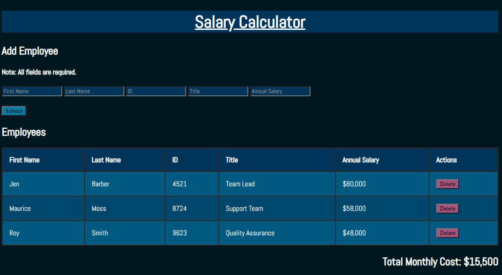

# WEEKEND JQuery Salary Calculator

## Description

_Duration: 2 Day Sprint_

This program calculates the total monthly cost of employees and displays all of the data in the table. The user should fill out all required fields of:

1. First Name
2. Last Name
3. Employee ID
4. Job Title
5. Annual Salary

Employees can also be deleted from the table.

## Screen Shot

Include one or two screen shots of your project here (optional). Remove if unused.

### Prerequisites

- Any IDE such as VS Code or a web browser.

## Installation

1. Fork the repository
2. Ensure that [git is installed](https://git-scm.com/downloads) on your Mac/PC.
2. Copy the SSH link under 'Code'.
3. Enter terminal(Mac) or Git Bash(Windows) and in your desired folder, type 'git clone git@github.com:hesscm/weekend-jquery-salary-calculator.git'.
4. Open with your preferred IDE.
5. Alternatively, open the 'index.html' file with any browser.

## Usage

1. Enter data in each required field. You cannot enter data with any empty fields.
2. You cannot enter duplicate IDs.
3. Submit the data with the 'Submit' button and note as the total monthly cost decreases.
4. To remove an employee, hit the 'Delete' button in their row and note as the total monthly cost decreases.

## Built With

HTML, CSS, JavaScript, JQuery

## Acknowledgement
Thanks to [Prime Digital Academy](www.primeacademy.io) who equipped and helped me to make this application a reality. (Shout out to Chris Black!)

## Support
If you have suggestions or issues, please email me at [chrishessmusic@gmail.com]